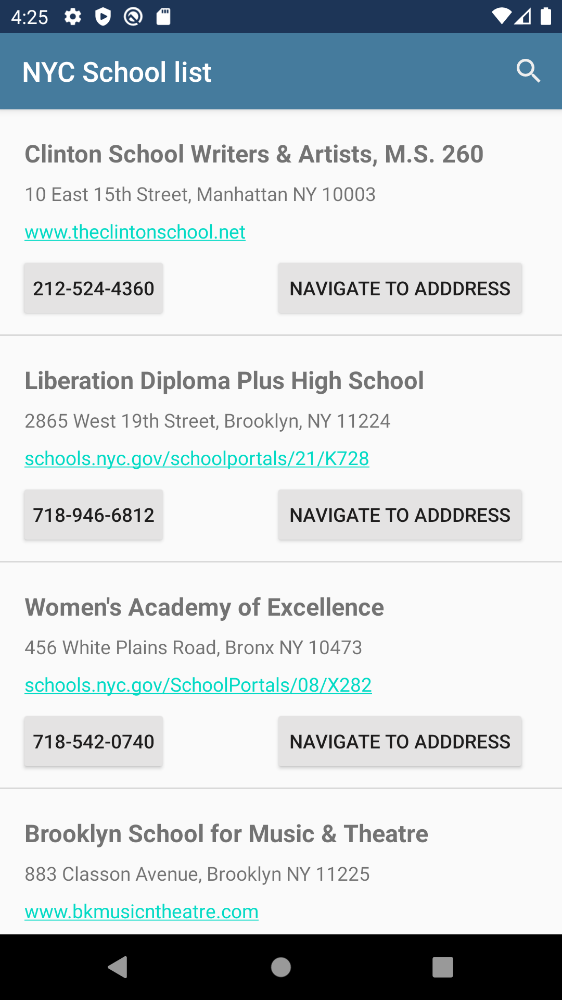

# NYCSchools - Android application written in Kotlin

Getting Started
---------------
This app was developed using the MVVM design patterm - Google android app architecture recommendatation.
The main principle of MVVM is separation of concerns, each component here is to follow a stand alone responsibility.

Screenshots
-----------
||
|
|

Features
-----------
the Application is compatible to android versions 21 to 30.
Classes have been designed in such a way that it could be inherited and maximize the code reuse.

School List screen:
-----------
Added SearchView to make it easier for the user to find a certain school inside of the application.
Option to call the school by simply pressing the schools phone number on the Initial Screen.
Option to navigate to the school simply by pressing the Navigate to Address button on the Initial Screen.
Option to like the school website link to quick glance the school website.

Details View screen:
-----------
School name
School SAT Scores
School Overview
Schools Contact Information

Testing
--------
Instrumentation & Unit testing for for all the various app components.

App flow logic
-----------
In order to test the app, project need to be opened in android studios
The project  can run directly on a simulator of your choice.
whenever the app launches it will first check sql-lite if there is any data, else will fetch the School's Data from the City of New York websites API.
Users can click on the searchView tp reveal a Search Bar in the toolbar bar.
User can use that search bar to search for schools.
Users can click on a school of their choice which will lead them to the school details page..
This action will present a new View Controller with the Selected Schools SAT Scores and other information.

Possible Enhancements
--------------

- Pagination to fetch school list based on certain query param.
- Filter support based on various fields.
- Extend testing to all the layers,(100 % code coverage).
- Integrate with Google maps, mapView of schools.
- Option to sort based on location, address, rating etc.

Libraries Used
--------------
Classes have been designed in such a way that it could be inherited and maximize the code reuse.

This app loads information from (https://data.cityofnewyork.us/resource/) to show one approach to using some of the best practices in Android Development.
Including:
  * [AppCompat]- Degrade gracefully on older versions of Android.
  * [Android KTX] - Write more concise, idiomatic Kotlin code.
  * [Test]- An Android testing framework for unit and runtime UI tests.
  * [Data Binding] - Declaratively bind observable data to UI elements.
  * [Lifecycles] - Create a UI that automatically responds to lifecycle events.
  * [LiveData] - Build data objects that notify views when the underlying database changes.
  * [Navigation] - Handle everything needed for in-app navigation.
  * [Room]  - Access your app's SQLite database with in-app objects and compile-time checks.
  * [ViewModel]- Store UI-related data that isn't destroyed on app rotations. Easily scheduleasynchronous tasks for optimal execution.
  * [UI] -  Details on why and how to use UI Components in your apps - together or separate
  * [Fragment] - A basic unit of composable UI.
  * [Layout] - Lay out widgets using different algorithms.
  * Third party and miscellaneous libraries
  * [Hilt]: for [dependency injection]
  * [Kotlin Coroutines] for managing background threads with simplified code and reducing needs for callbacks

